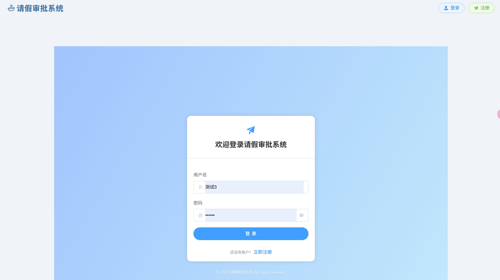

# 请假审批系统 - 前端 (Leave Approval Frontend)

本项目是一个使用 Vue 3, Vite, Pinia, Vue Router 和 Element Plus UI 库构建的现代化请假审批系统的前端界面。它提供了用户友好的界面，用于提交请假、跟踪审批进度、处理审批任务以及管理用户账户（管理员功能）。

![登录页面示例] 
## ✨ 项目特色与亮点

*   **现代化技术栈**: 基于 Vue 3 (Composition API, `<script setup>`), Vite (极速的构建与开发体验), Pinia (官方推荐的状态管理库), Vue Router (官方路由)。
*   **优雅的UI设计**: 全面采用 Element Plus 组件库，并结合自定义样式，打造专业、美观且响应式的用户界面。支持浅色/深色模式（基于系统偏好和全局CSS变量）。
*   **完善的用户认证与授权**:
    *   基于 JWT (JSON Web Token) 的认证机制。
    *   精细的路由守卫，实现基于角色的访问控制 (RBAC) 和页面保护。
    *   自动在API请求中携带认证Token。
    *   处理常见的认证错误（如401自动登出）。
*   **完整的请假审批核心流程**:
    *   用户可以方便地提交各类请假申请，并可指定直属经理（如果业务允许）。
    *   清晰展示个人提交的请假记录及其当前审批状态，支持分页浏览。
    *   提供请假申请详情查看功能。
    *   用户可以取消处于待审批状态的请假申请。
*   **高效的审批工作台**:
    *   审批人可以清晰地看到分配给自己的待审批任务列表，支持分页。
    *   提供便捷的批准/驳回操作界面，并可填写审批意见。
*   **强大的管理员后台**:
    *   集中管理所有系统用户账户。
    *   支持创建新用户，并为其分配合适的角色和直属经理。
    *   能够编辑现有用户信息，包括基本资料、角色、直属经理及账户状态（启用/禁用）。
    *   安全地删除用户账户。
*   **优秀的用户体验**:
    *   所有异步操作均有加载状态提示。
    *   使用 Element Plus 的 `ElMessage` 和 `ElMessageBox` 提供友好的操作反馈和确认提示。
    *   表单校验清晰明了。
    *   页面切换具有平滑的过渡动画。

## 🛠️ 技术栈详解

*   **核心框架**: Vue 3.x
*   **构建工具**: Vite 5.x (或更高)
*   **状态管理**: Pinia 2.x
*   **路由**: Vue Router 4.x
*   **UI 组件库**: Element Plus (最新稳定版)
*   **HTTP 客户端**: Axios (通过封装的 `src/services/api.js` 服务，配置了请求/响应拦截器)
*   **CSS**:
    *   全局样式 (`src/style.css` 或 `src/assets/main.css`)
    *   Scoped CSS (组件内样式)
    *   CSS 自定义属性 (CSS Variables) 实现主题化和深浅色模式支持
*   **图标库**: `@element-plus/icons-vue`
*   **开发语言**: JavaScript (ES6+)
*   **包管理器**: npm / yarn / pnpm (根据您的项目选择)

## 🚀 主要功能模块

1.  **认证模块 (`/api/auth`)**
    *   用户登录 (`LoginPage.vue`)
    *   用户注册 (`RegisterPage.vue`) - 支持选择直属经理
    *   用户登出 (通过导航栏)
    *   获取可选经理列表 (供注册和用户管理使用)
2.  **主应用模块**
    *   仪表盘/主页 (`DashboardPage.vue`) - 根据用户角色显示快捷入口
    *   全局导航栏 (`Navbar.vue`) - 动态菜单，用户信息展示
    *   应用主布局 (`App.vue`) - 包含导航和路由视图区，页面切换过渡
3.  **请假申请模块 (`/api/leave-requests`)**
    *   提交请假申请 (`SubmitLeavePage.vue`)
    *   我的请假申请列表 (`MyRequestsPage.vue`)
    *   请假申请详情 (`LeaveRequestDetailsPage.vue`)
    *   取消请假申请
4.  **审批模块**
    *   待我审批列表 (`PendingApprovalsPage.vue`)
    *   处理审批操作 (批准/驳回，填写意见)
5.  **管理员模块 (`/api/admin/users`)**
    *   用户管理列表 (`AdminUsersPage.vue`)
    *   创建用户
    *   编辑用户 (包括修改经理、角色、状态)
    *   删除用户

## ⚙️ 项目设置与运行

**开发环境前提条件:**
*   Node.js (推荐 v18.x 或 LTS 最新版本)
*   npm (v9.x+) 或 yarn (v1.22.x+) 或 pnpm (v8.x+)

**安装项目依赖:**
在项目根目录下执行：
```bash
npm install
# 或者
# yarn install
# 或者
# pnpm install